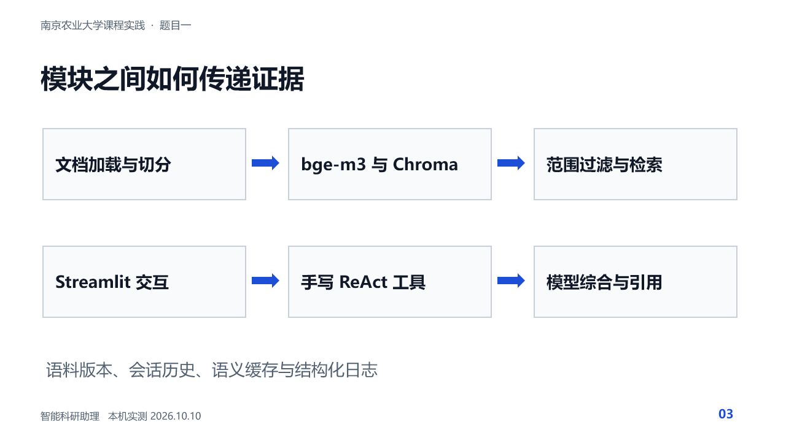

# 智能科研助理论文知识库技术设计文档

本项目为南京农业大学课程实践题目一，研究方向为 Transformer 在计算机视觉中的应用。我们在原有 ragagent 仓库基础上迁移到本机 D 盘，补全索引、工具调用、实验和交付材料。所有数字来自保存的实测文件，不沿用任务说明中的示例提升比例。

本项目为南京农业大学课程实践题目一，研究方向为 Transformer 在计算机视觉中的应用。我们在原有 ragagent 仓库基础上迁移到本机 D 盘，补全索引、工具调用、实验和交付材料。所有数字来自保存的实测文件，不沿用任务说明中的示例提升比例。

## 项目目标与验收范围

系统支持本地导入论文、带页码检索、多论文分析、计算工具和会话管理。设计重点是证据可追溯、模块可替换及错误可观察。联网搜索为可选能力，本版本未接入外部搜索服务。

## 系统架构

Streamlit 接收文档和问题。加载器输出包含 doc_id、doc_name、物理页码和文本的记录，切分后经 bge-m3 转为向量并写入 Chroma。Agent 根据问题选择工具，检索工具返回证据，模型综合后以流式方式显示答案，轨迹和指标同步进入日志。

层次 | 实现文件 | 责任
--- | --- | ---
交互 | ui/app.py | 三列布局、会话、上传管理、轨迹和健康检查
决策 | agent/react_loop.py | 手写 ReAct、快速路由、并行与历史管理
工具 | tools/registry.py | 八个工具的签名、描述、执行函数
生成 | rag/chain.py 与 rag/cache.py | 上下文、引用、缓存、降级与日志
检索 | retriever/api.py 与 store.py | 范围过滤、增量索引、三种检索
基础 | common/config.py 与 llm.py | 统一配置、数据结构和本地模型客户端

架构图的原生可编辑版本位于答辩 PPT 第三页，显示离线文档处理和在线问答两条链路。

## 数据加载与增量索引

PDF 默认用 PyMuPDF 提取并记录从 1 开始的物理页码，过滤参考文献后切分。DOCX、TXT、MD 作为逻辑页 1 处理。PDF 超过 300 页拒绝加载，网页限制单文件 32 MB。批量导入逐文件报告成功或失败，瞬态异常最多尝试三次，格式或路径错误直接返回。扫描文档没有 OCR，需要先获得可提取文本的 PDF。

Chroma 按 chunk_id upsert，同一文档重导入会删除旧版本多余块。仅为新文本生成向量，SQLite 嵌入缓存按模型及文本哈希复用。索引记录嵌入模型和语料版本，拒绝把不同模型向量混在同一个库。Windows 原生 HNSW 在中文目录出现重启失败，因此采用 D:/NJAU_RAG_Data/index。

## 向量数据库选型

维度 | Chroma | FAISS
--- | --- | ---
文档元数据与过滤 | 直接保存文档及页码，支持 where | 需要额外映射和过滤逻辑
增量文档管理 | upsert 和 delete 直接可用 | 需管理 ID 与删除策略
运行与性能 | 持久化适合课程规模 | 专注近邻搜索，适合大规模扩展
本项目决定 | 采用并实际运行 | 只做设计比较，未做性能对跑

## 检索与证据拼接

vector 使用归一化向量近邻。hybrid 将向量与 BM25 候选按 RRF 排名融合，当前权重 0.7 与 0.3。rerank 使用 bge-reranker-base 对候选重排。指定 doc_ids 在向量查询和 BM25 语料构建之前生效，多论文任务可分别检索后合并，避免小论文被候选集合挤掉。上下文按相关性排列并截断，证据标记采用【文档名-第X页】。

检索模式 | Hit@5 | MRR@5 | Recall@5 | 平均延迟 ms
--- | --- | --- | --- | ---
vector | 71.7% | 0.386 | 60.8% | 126.134
hybrid | 63.3% | 0.374 | 55.6% | 109.354
rerank | 56.7% | 0.318 | 49.7% | 5787.308

本次实测 vector 的 Hit@5 最高，因此最终默认 vector，同时保留另外两种模式供复现。检索分数是模型相似度或重排分值，不是校准后的正确率。

## Agent 控制与工具

工具 | 用途
--- | ---
rag_search | 返回知识库证据与来源
paper_meta | 首页与已核验 manifest 的标题作者年份摘要 DOI
paper_compare | 逐论文检索方法、数据集和结果
extract_keywords | 提取关键词
summarize_paper | 生成背景方法结果结论所需的证据
current_time | 北京时间 UTC+08:00
calculator | 受限 AST 运算
list_documents | 查看真实 doc_id 和块数

同步和流式 API 共享事件引擎，最多四轮，每轮最多三个独立工具并行。计算、日期和列表采用确定路由，不消耗模型生成 Token。明确论文的元信息直接返回核验记录，其他明确论文任务先执行对应工具再生成；一般问题继续使用 JSON ReAct 规划。工具参数按函数签名校验，连接异常重试一次，超时跳过。线程超时不能强杀已运行的函数，后台调用仍可能短暂占用资源。

## 缓存和会话记忆

语义缓存存入 SQLite，精确问题先查，再以向量余弦相似度 0.97 匹配。键包括语料版本、模型、检索模式、文档范围、会话和历史。数字及英文专业词变化禁止复用，TTL 为 24 小时，最多 1000 条。错误或漏引用的模型回答不写入 Agent 缓存。不同会话独立保存，历史预算按字符保守估算 3000，保留最近三轮并将较早内容摘要压缩。报告中的生成 Token 则来自 Ollama API 实际计数。

## 引用控制与降级

错误页码从最终答案中替换为引用未核验。模型漏掉逐句引用时，附上真实检索来源并标明需要核对，missing_citations 指标为真且该回答不视为通过引用要求。无结果时可生成一般知识回答并标注未经知识库核验，低相关性时提示并展示候选，API 失败时给出重试建议。

## 接口与数据结构

函数 | 主要参数 | 返回结果
--- | --- | ---
load_any | path 文件路径 | 含 doc_id 页码和文本的页面列表
ingest_with_retry | path attempts chunk_mode | 成功块数或异常
retrieve_best | query topk doc_ids | RetrievedChunk 列表
rag_answer | query topk doc_ids options | answer citations metrics debug
react_loop | question history doc_ids session_id | answer trace metrics tool_stats success
react_loop_stream | 同同步接口 | thought action observation final_chunk done 事件
remove_doc | doc_id | 删除文档并使索引版本变化

RetrievedChunk 字段为 chunk_id、doc_id、doc_name、page、text、score。AgentStep 包含 step_idx、thought、action、action_input、observation、elapsed_ms。流式 done 事件保存最终经过引用校验的答案，前端以它更新会话，不能只拼接未核验的生成片段。

## 关键配置参数

配置 | 本机值 | 作用
--- | --- | ---
OLLAMA_MODEL | qwen2.5:3b | 生成与规划模型
EMBEDDING_MODEL | bge-m3:567m | 嵌入及检索
INDEX_DIR | D:/NJAU_RAG_Data/index | Windows ASCII 索引路径
RETRIEVAL_MODE | vector | vector hybrid rerank 可切换
CHUNK_MODE | section | 章节切分
MODEL_CONTEXT | 4096 | 模型上下文 Token 上限
MAX_OUTPUT_TOKENS | 512 | 单次输出上限
CACHE_THRESHOLD | 0.97 | 语义缓存阈值
LLM_TIMEOUT 与 TOOL_TIMEOUT | 300 秒 | 客户端与工具等待上限

## 部署配置与当前边界

本机 Python 3.12、Ollama、Qwen2.5 3B、bge-m3、重排及对照模型均存放在 D 盘。16 GB 内存和 CPU 推理条件下采用 3B 以保证能运行，但不能期待大模型级别的理解质量。依赖通过 uv.lock 和 requirements-lock.txt 锁定。Dockerfile 和 Compose 提供容器方案，本机无 Docker，仅做配置静态核对。

独立人工评分仍待组员完成。引用页码存在仅说明来源能够定位，不等于该句受到原文支持。评测集包含初步人工编写与关键词辅助定位的答案和页码，正式评分前需复核标注。结果仅适用于当前论文集合和硬件。
