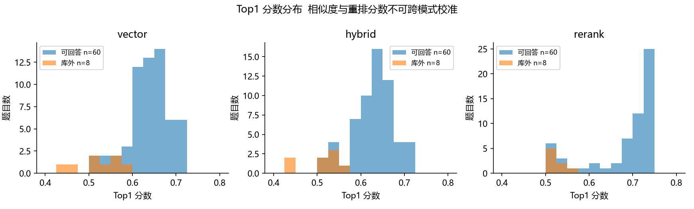

# 智能科研助理综合评测报告

南京农业大学课程实践 题目一

本项目为南京农业大学课程实践题目一，研究方向为 Transformer 在计算机视觉中的应用。我们在原有 ragagent 仓库基础上迁移到本机 D 盘，补全索引、工具调用、实验和交付材料。所有数字来自保存的实测文件，不沿用任务说明中的示例提升比例。

## 数据与评测协议

语料共 12 篇公开论文，合计 260 个 PDF 物理页。检索集包含 68 道题，其中 36 道事实、12 道对比、6 道归纳、6 道推理、8 道库外问题。检索质量在 60 道可回答题上计算，8 道库外题另看拒答与 Top1 分布。Agent 选取其中 20 道代表题，加 4 道工具问题，实际运行 24 次。

gold_sources 采用文档 ID 与物理页码组成的集合，不混淆不同论文同页。Hit@5 表示至少一个目标来源出现在前五块；MRR@5 是第一个目标来源排名的倒数；Recall@5 为目标来源召回比例；all_sources@5 要求多篇论文目标全部找回。相邻页含同样答案仍可能按严格页码算未命中。

## 三种检索结果

检索模式 | Hit@5 | MRR@5 | Recall@5 | 平均延迟 ms
--- | --- | --- | --- | ---
vector | 71.7% | 0.386 | 60.8% | 126.134
hybrid | 63.3% | 0.374 | 55.6% | 109.354
rerank | 56.7% | 0.318 | 49.7% | 5787.308

重排序没有带来预期收益。当前候选、中文问题与英文证据、模型领域匹配和参考文献惩罚都可能影响结果，需要逐条分析，不能仅凭该实验确定单一因果。三种模式保留原始 Top5、问题、目标页及分数。

延迟结果包含冷启动、嵌入缓存、重排加载以及同机其他实验竞争。rerank 第一题包含约 87 秒加载，因此平均延迟不是纯推理速度。只运行一次，不提供统计置信区间，也不以这些时间认定严格的硬件性能优劣。

## Top1 分数分布自评

可回答题与库外题的 Top1 分数分布存在重叠，单一阈值不能保证可靠拒答。向量相似度与重排 sigmoid 分数语义不同，不能横向当作概率比较。分布原始统计在 top1_distribution.json。样本规模 60 与 8 不等，图中为题目数量而非比例。

## Agent 实测

指标 | 结果 | 口径
--- | --- | ---
工具路由 | 91.7% | 至少调用一个期望工具
平均迭代 | 1.042 | 包含确定路由，不表示模型推理轮次
平均端到端延迟 | 16.921 s | 实际请求壁钟时间
平均 Token | 1100.000 | Ollama 输入加输出计数
执行及引用门槛通过 | 29.2% | 不能代替内容正确率
无效页码数 | 0 | 引用是否在观察来源中
漏逐句引用请求 | 17 / 24 | 附来源提示，禁止缓存

两个对比任务未命中预期 paper_compare，而是分别调用 rag_search。仍可取得多文档资料，但按工具标签定义属于路由未命中。页码验证无法发现“引用存在但事实误读”的错误。独立人工质量评分尚未完成，不能宣称人工正确率或完整性达到某一比例。

## 组件与生成参数

切分方式 | 块数 | 平均字符 | Hit@5 | MRR@5
--- | --- | --- | --- | ---
fixed256 | 391 | 245.1 | 75.0% | 0.562
fixed512 | 200 | 475.0 | 62.5% | 0.531
fixed1024 | 108 | 867.3 | 62.5% | 0.479
recursive1024 | 102 | 889.7 | 75.0% | 0.483
semantic1024 | 108 | 873.3 | 62.5% | 0.244
section1024 | 122 | 749.5 | 75.0% | 0.656

切分实验固定 Transformer 与 MAE 两篇、八道题，章节点切分 MRR 最高。样本不足以代表所有论文。切分长度单位为字符，不是 Token。

嵌入模型 | 维度 | Hit@5 | MRR@5 | 耗时 s
--- | --- | --- | --- | ---
bge-m3:567m | 1024 | 75.0% | 0.656 | 0.108
m3e-base | 768 | 50.0% | 0.333 | 58.125
bge-large-zh-v1.5 | 1024 | 75.0% | 0.448 | 166.361

三种嵌入使用相同 122 块及八道题，bge-large-zh-v1.5 查询使用检索指令前缀。bge-m3 命中嵌入缓存，其计时不可直接与两个本地模型的首次计算时间比较。

温度 | Top-p | Top-k | 输出 Token | 延迟 s
--- | --- | --- | --- | ---
0.0 | 0.9 | 40 | 187 | 76.379
0.5 | 0.9 | 40 | 173 | 139.950
0.8 | 0.9 | 40 | 108 | 95.920
0.1 | 0.7 | 20 | 191 | 62.649

生成参数只比较一道 MAE 问题，保存四份真实回答供人工核对。它说明输出变化，不能建立总体质量排名。默认低温度 0.1，以减少随机变化。

## 缓存与边缘验证

测试 | 结果
--- | ---
cache_cold | 缓存命中 False，98 ms
cache_exact | 缓存命中 True，1 ms
cache_semantic | 缓存命中 True，1 ms
concurrent_MAE | 来源隔离 True
concurrent_Swin | 来源隔离 True
301_page_limit | True
load_docx | True
load_txt | True
load_md | True
empty_knowledge_base | True

缓存实测采用元信息问题及其中文改写，独立隔离验证采用 MAE 与 Swin 并发请求。缓存速度是这个具体样例的结果，不能声称所有问题都有同样加速。来源隔离只检查文档混入，不证明回答正确。27 项自动化测试覆盖并行、超时、签名、缓存失效、历史预算、多来源指标和引用检测。

## 人工评审方法

使用 experiments/results/manual_review.csv，由未参与答案生成的组员对正确性、完整性、引用准确性各打 0 至 5 分，记录评审人和备注。正确性 0 为关键事实错误或无法回答，3 为主体正确但有局部偏差，5 为完全吻合原文。完整性检查问题要求是否全部覆盖。引用准确性必须打开论文对应页核对支持关系。建议两人独立评分，分差超过 1 分时复议。

独立人工评分仍待组员完成。引用页码存在仅说明来源能够定位，不等于该句受到原文支持。评测集包含初步人工编写与关键词辅助定位的答案和页码，正式评分前需复核标注。结果仅适用于当前论文集合和硬件。

## 论文来源

文档 | 年份 | arXiv ID
--- | --- | ---
Transformer | 2017 | 1706.03762
ViT | 2020 | 2010.11929
DeiT | 2020 | 2012.12877
Swin | 2021 | 2103.14030
DETR | 2020 | 2005.12872
PVT | 2021 | 2102.12122
BEiT | 2021 | 2106.08254
MAE | 2021 | 2111.06377
CLIP | 2021 | 2103.00020
CvT | 2021 | 2103.15808
CaiT | 2021 | 2103.17239
MobileViT | 2021 | 2110.02178

各论文的官方页面、PDF 链接、SHA256、页数及首页作者文本均保存在 experiments/corpus_manifest.json。上游 PDF 版本更新会改变页码和哈希，复现应优先使用交付包中的原始文件。
