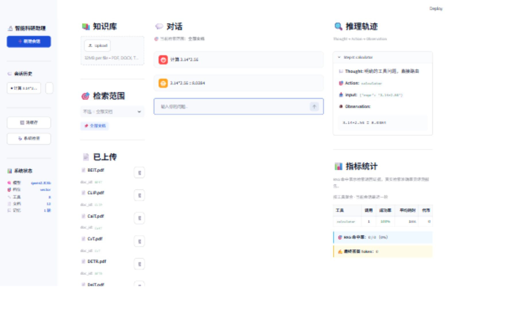

# 智能科研助理安装与使用手册

南京农业大学课程实践 题目一

本手册说明当前电脑启动、日常论文管理、问答演示和另一台电脑复现。所有主要文件在 D 盘，应用地址为 http://127.0.0.1:8501。

## 当前电脑快速启动

打开 D:/生产实习大作业/ragagent，双击 start_app.cmd。脚本检查本地 Ollama 与 Streamlit 服务，未启动时在后台启动。首次模型加载会比后续慢。出现报错先查看 data/logs/streamlit.err.log 与 ollama.err.log。不要移动或删除同级 runtime、models 及索引目录。

图示为本机实际计算工具演示，界面左侧管理资料，中间对话，右侧查看决策轨迹和指标。

## 导入与管理文档

左侧选择 PDF、DOCX、TXT、MD 文件并上传，点击导入后查看逐文件进度。PDF 最大 300 页、单文件最大 32 MB。扫描 PDF 需要先 OCR。同名文档再次导入更新原有块，不用重建全部论文。删除文档会移除索引并使相关缓存失效。删除前确认已保留原始论文。

## 提问与核验

可以选定文档范围，也可以在问题中写真实论文 ID，例如“MAE 的作者和年份是什么”“比较 ViT 与 DeiT 的训练方法区别”“计算 3.14*2.56”。引用使用 PDF 物理页码。读答案后应打开对应原文检查是否支持结论，尤其是数值、方法比较与因果解释。看到漏引用或引用未核验提示时，应缩小问题、重新提问或直接阅读原文。

## 会话和指标

新建会话使历史独立，切换会话可继续之前的问题。右侧显示工具输入、观察、耗时和 Token。这里的 RAG 命中仅指工具返回带页码的证据，并不是正确率。真实检索准确率查综合评测报告。清空语义缓存会删除可复用回答，但不删除论文。健康检查验证模型服务、所需模型和向量库状态。

## 另一台 Windows 电脑安装

将完整代码包解压到 D 盘，在 PowerShell 运行 powershell -ExecutionPolicy Bypass -File scripts/setup.ps1。脚本从官方源下载工具及模型，需要网络和足够磁盘空间。之后检查 .env 的 INDEX_DIR 为 ASCII 路径，使用 .venv/Scripts/python.exe scripts/ingest_corpus.py 导入论文，再双击 start_app.cmd。环境默认 Python 3.12，依赖由 uv.lock 锁定。若不包含论文，先运行 scripts/download_papers.py。

## 检索和模型切换

在 .env 设置 RETRIEVAL_MODE=vector、hybrid 或 rerank，重启应用生效。当前默认 vector。重排模型首次从 Hugging Face 下载，可在 RERANKER_MODEL 指向本地目录。更换 EMBEDDING_MODEL 时必须使用新的 INDEX_DIR 并重新导入。生成模型在 OLLAMA_MODEL 配置，不要只改网页显示。

## Docker 部署

安装 Docker 后执行 docker compose up --build，模型初始化完成后执行 docker compose exec app python scripts/ingest_corpus.py。数据挂载在 ./data，模型使用命名卷，浏览器访问 localhost:8501。本机没有 Docker，此方案尚未实际构建验证。

## 常见问题

现象 | 处理方法
--- | ---
页面打不开 | 运行启动脚本，检查 8501 端口和 Streamlit 日志
模型请求超时 | 等待当前 CPU 任务完成，健康检查后重试
向量库重启报错 | Windows 改用 ASCII 路径，新建库并导入
某文档检索不到 | 确认真实 doc_id、导入成功及检索范围
问题超出知识库 | 按提示核验外部资料，不将一般知识当论文结论
引用在但内容错 | 查对应 PDF 页，人工核对后修订答案

## 演示顺序

建议依次展示健康检查、十二篇文档、元信息、论文问答、两论文对比、计算器、会话切换、缓存重复问题，最后用一次真实错误案例说明核验边界。完整实验命令见 README。
